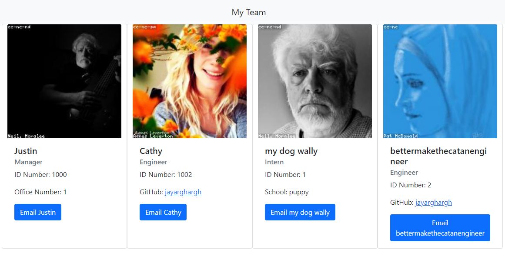

[](https://img.shields.io/badge/License-&#58&#41-yellow)
# Team Profile Generator
## Description
Allows the user to create a profile of their team in a html / css format.
[view screencast on youtube(including tests)](https://youtu.be/znRy1zGvWdw)


## Table of Contents
> - [Description](#Description)
> - [Table of Contents](#Table-of-Contents)
> - [Installation](#Installation)
> - [Usage](#Usage)
> - [License](#License)
> - [Contributing](#Contributing)
> - [Tests](#Tests)
> - [Questions](#Questions)
## Installation
```git clone https://github.com/JayArghArgh/team-profile-generator.git``` Will clone the repo and create the following directory structure.
```md
__tests__/			// jest tests
  Employee.test.js
  Engineer.test.js
  Intern.test.js
  Manager.test.js
dist/               // rendered output (HTML)
lib/				// classes
src/				// template helper code
index.js			// runs the application
```
Install with ```npm i```
## Usage
Navigate to the main directory and ```node index.js``` to run.
Your created webpage can be found at ```/dist/index.html```
## License
This application is covered under None.
## Contributing
Appreciate the bug reporting!
## Tests
```npm run test```
Each class is tested for instantiation and method returns using Jest.
## Questions
Please refer any questions to [](https://github.com/JayArghArgh) via jayarghargh@gmail.com.

[](https://github.com/JayArghArgh/github-readme-stats)


> [](https://github.com/JayArghArgh) This README.md created with [](https://github.com/JayArghArgh/pro-readme-generator).

